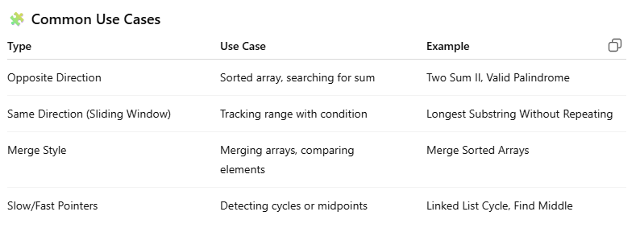

🧠 When to Use

Use when:

* You need to compare or process elements from both ends of a structure

* You need to find pairs or ranges that satisfy a condition

* You can solve in O(n) time instead of brute-force O(n²)

### Ways to identify when to use the Two Pointer method:

* It will feature problems where you deal with sorted arrays (or Linked Lists) and need to find a set of elements that fulfill certain constraints
* The set of elements in the array is a pair, a triplet, or even a subarray

